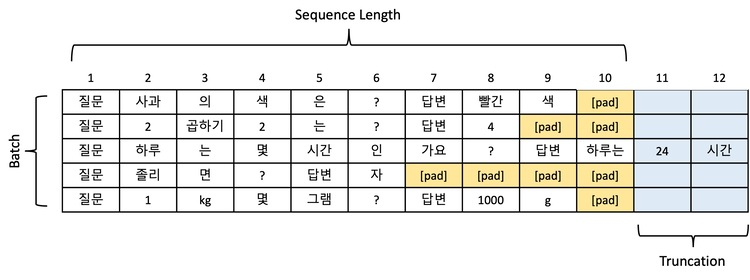

# 25-1-DS-Week-2-Assignment

# Assignment1
	WordPieceTokenizer 구현해보고 기존 BPE와 성능 비교해보기
	다른 과제처럼 #TODO 부분 구현해주신 다음 tokenizer_test.py를 실행하여 BPE와의성능비교해보기!.
	우선 make_voca.py를 통해 voca.txt를 생성해 주자.
	python tests/tokenizer_test.py 를 실행했을때, 아래 Example과 같이 나온다면 성공! 

## 디렉토리 구조
```bash
Assignment1/
├── src/
│├── __init__.py
│├── utils.py
│	├── make_voca.py
│	├── vocab.txt
│   └── WordPieceTokenizer.py
└── tests/
	├── __init__.py
	├── tests.txt
    └── tokenizer_test.py

```

## Running Tests

Test the tokenizer against hugging's face implementation:

```bash
pip install transformers
python src/word_piece_tokenizer/make_voca.py
python tests/tokenizer_test.py
```

## Example 

```python
The tree fell unexpectedly short.
[464, 5509, 3214, 25884, 1790, 13]
['[UNK]', 'tree', 'fell', 'unexpectedly', 'short', '##.']

 Performance Results:
BPE tokenizer: 6.458908319473267e-05
This tokenizer: 9.03010368347168e-06
This tokenizer is 86.02% faster
[Average] This tokenizer is 81.31% faster

you are짱 짱짱bye bye
[5832, 389, 168, 100, 109, 23821, 100, 109, 168, 100, 109, 16390, 33847]
['you', '[UNK]', '[UNK]', 'bye']

 Performance Results:
BPE tokenizer: 0.00020454823970794678
This tokenizer: 1.5280209481716156e-05
This tokenizer is 92.53% faster
[Average] This tokenizer is 81.52% faster


```

# Assignment2
max token length를 구하여 LLM 학습 최적화 하기.

## Task 

✔ 데이터셋 분포 분석
데이터셋에 긴 문장이 많으면 시퀀스 길이를 늘리고, 짧은 문장이 대부분이라면 줄이는 것이 효율적입니다.
예: 데이터셋의 95%가 1,024 토큰 이하라면, 시퀀스 길이를 1,024로 설정해 리소스를 최적화할 수 있습니다.

✔ 시퀀스와 배치 크기의 균형
긴 시퀀스는 모델 성능을 향상시킬 수 있지만, GPU 메모리 사용량이 늘어나 배치 크기를 줄여야 할 수 있습니다.
따라서 데이터셋의 특성을 보고 시퀀스 길이를 적절히 조절하고 배치를 늘려야 효과적인 학습이 될 수 있습니다.

[출처: https://devocean.sk.com/blog/techBoardDetail.do?ID=167242&boardType=techBlog]


## ToDo
1. run.sh를 실행하여, correct_data.txt를 생성한다.
2. calculate_token_length.ipynb를 실행하여 적절한 gen_length와 max token length를 구한다.
3. 2번에서 구한 gen_length와 max token length값을 cqa.json 넣어준다.(초기값 수정)
4. calculate_token_length.ipynb를 실행하여 나온 결과값을 캡처하여 깃에 올려주면, 성공. 

## cqa.json
```
{
    "epochs": 1,
    "grad_accumulation": 1,
    "gen_length": 159,
    "batch_size": 2,
    "test_batch_size": 32,
    "lr": 1e-05,
    "weight_decay": 0.01,
    "warm_up_steps": 100,
    "model_dir": "checkpoints/",
    "log_divisor": 100,
    "save_divisor": 5,
    "exp_name": "testrun",
    "optimizer": "Adam",
    "scheduler": "linear",
    "precision": "bf16",
    "model_name": "meta-llama/Llama-3.2-3B",
    "max_length": 256,
    "n_shot": 7,
    "self_consistency": 5,
    "delete_model_after_loading": true,
    "accumulate": false,
    "task": "cqa",
    "inference_temp": 1.0,
    "no_hint": false
}
```

## 디렉토리 구조
```bash

Assignment2/
├── CommonsenseQA/
│   └── test.json
├── configs/
│   └── cqa.json
├── cqa(generated)
│	...
│	└── correct_data.txt
├── calculate_token_length.ipynb
├── run.sh
├── main.py
├── utils.py
├── device_inference.py
└── iteration_train.py
```
## Example 

```
전체 블록 중 최대 토큰 개수 (max token length): 186
전체 블록 중 최대 생성토큰 개수 (gen_length): 125
전체 블록 중 최대 토큰 결과 (max_sentence): The answer must be a place which could be dirty during the big football game. Television (A) would not be something dirty, so it cannot be the answer. Attic (B) and corner (C) would be places which would be dusty, so these two cannot be the answer. Library (D) is also out because we have been told that they cannot clean the corner and library during football matches, so it cannot be the answer. Ground (E) is also out because we cannot clean the ground during the football match, so it cannot be the answer. This leaves the only option: television (A).
```
